# Initial Ideas/Cut Content
Initially inspired by games on neal.fun like the password game, I originally wanted to create my own sort of mash-up of different challenges. The sequence would have gone like this: Popups, Light Puzzle, Tower of Hanoi, Cup Game, and Cup Game 2.

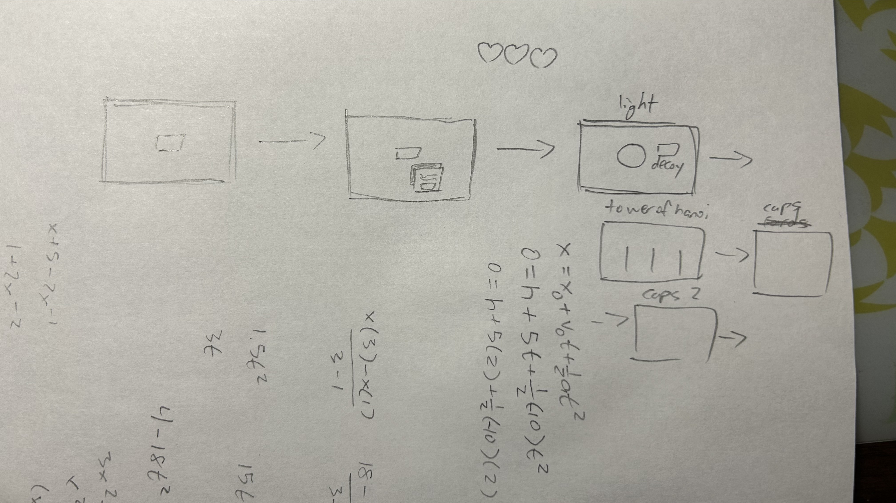

However, I soon realized that I was being too ambitious for a week-long project and pivoted to having increasingly difficult Cup Games and a "boss fight" at the end (which still took a considerable amount of time).

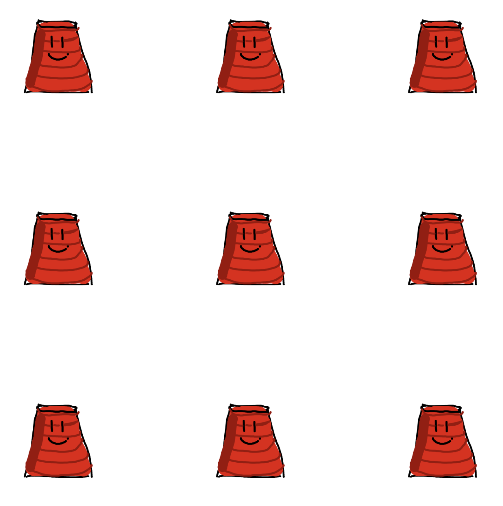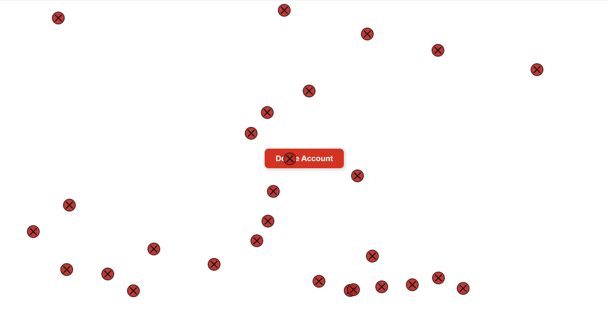

I also wanted to create a "lives" system, where you would have three tries before having to restart. I even got to making icons for them below:

After working on other functionality, however, I realized that there wasn't a good way for it to fit in with the whole "dialogue in pop-ups" thing I was doing, so I had to scrap it.
# Developer Notes
This was the first project that I made for Hack Club, but I like how it turned out!

## Initial Delete Button/Popups
The first things I made were the "Delete Button" and popups.

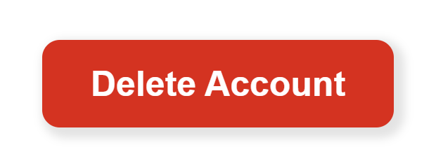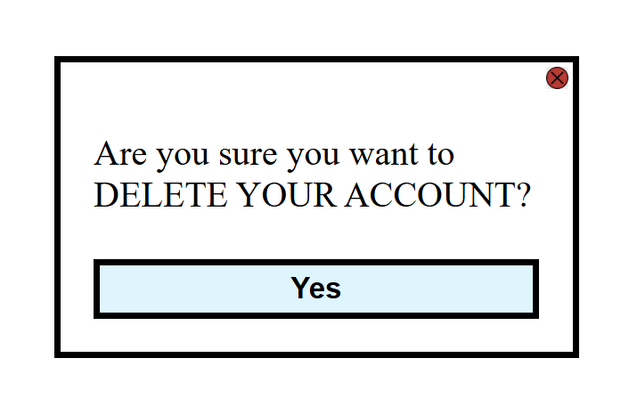

The hardest part of making the Delete Button was centering it on the screen with flexbox. However, the popups took more time. I used grid to make the text and button appear on seperate lines, and I made the X icon in Inkscape.
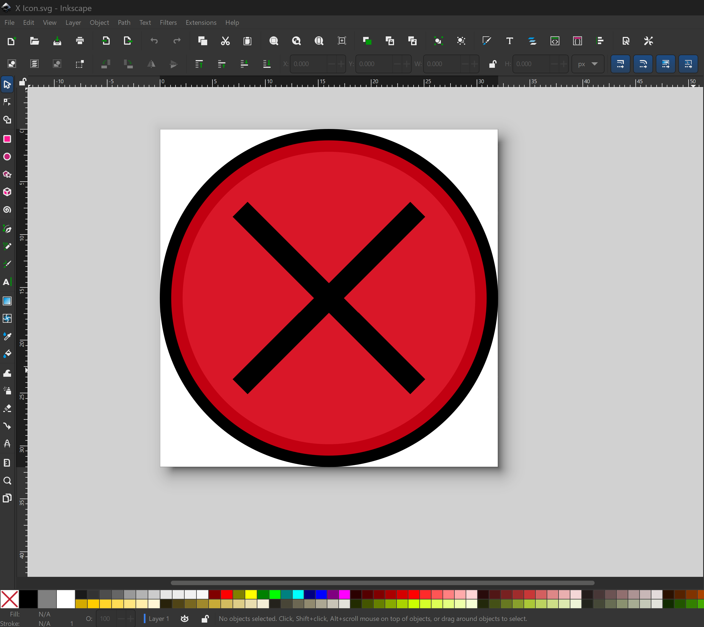

To position the X button, I just set its position to absolute and used the right and top css properties.

To handle the popup dialogue without some weird recursive structure in my code (in previous projects, I nested functionality and it was very messy), I used a JSON structure to store the dialogue options and added an "index" variable to my functions (I also used this approach for the cup games).
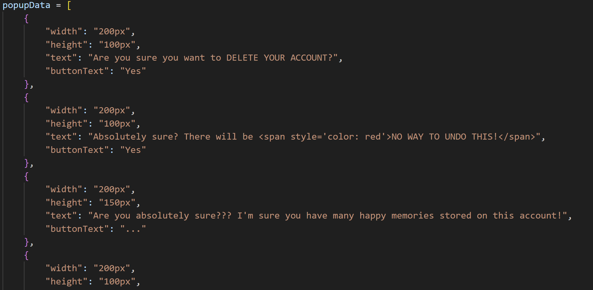

The hardest parts of implementing the popups were the opening and closing animations. In the past, I didn't use css animations much, so it was a learning experience. Specifically, for the closing animation, I set an event listener for a transition end event (at the time, I didn't know that animations also had an end event that you could detect).

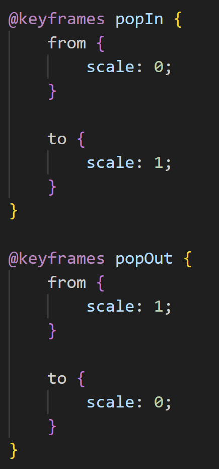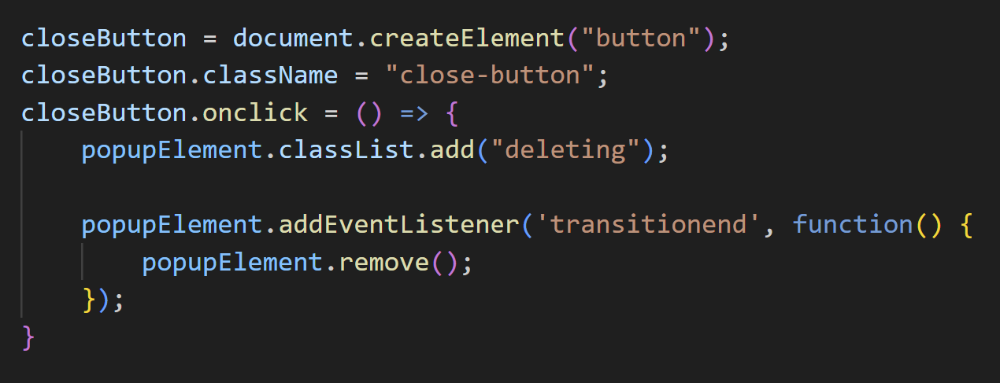

Later, I made the popups close the previous one to prevent a bug where you could open multiple of the same popup.

## Cup Games
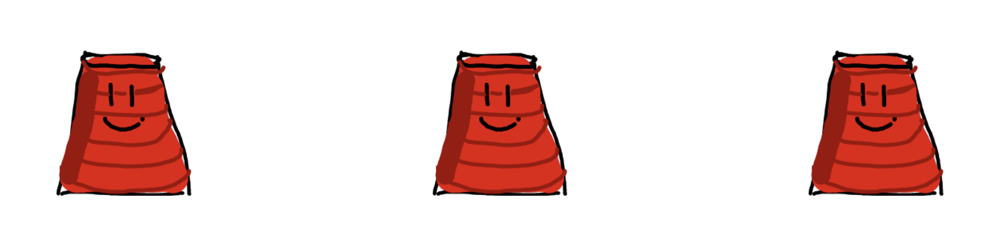
This section took me the longest to code. Initially, I wanted to use CSS grid to align the different cups, but I soon realized that it wouldn't work with the animations that I had in mind. Instead, I made each cup proportional to the viewport width (later I changed it to take the smallest of the viewport width and height) and aligned each cup with the left and top CSS properties. 

For the cup swapping animations, I used CSS transitions to interpolate when I randomly selected two cups and set their left and top properties to each other. Depending on the current round's settings, I used Javascript to change the animation speed and amount of swaps.

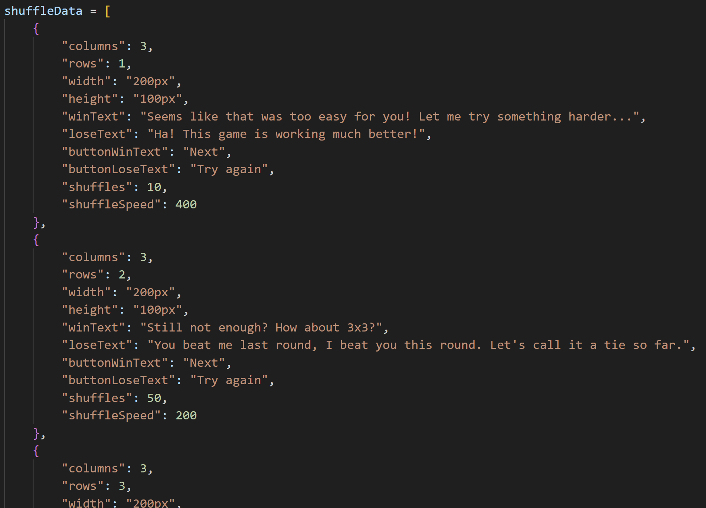

One thing that I had to cut out was the lose dialogue when you lost a round. Although I liked the idea of multiple lives, I realized that losing multiple times would make the dialogue repetative.

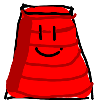

While I was testing, I made this placeholder sprite for the cups in Krita. Although it was initially meant to be temporary, I kind of grew attached to it and kept it in my project.

## The "Boss Fight"
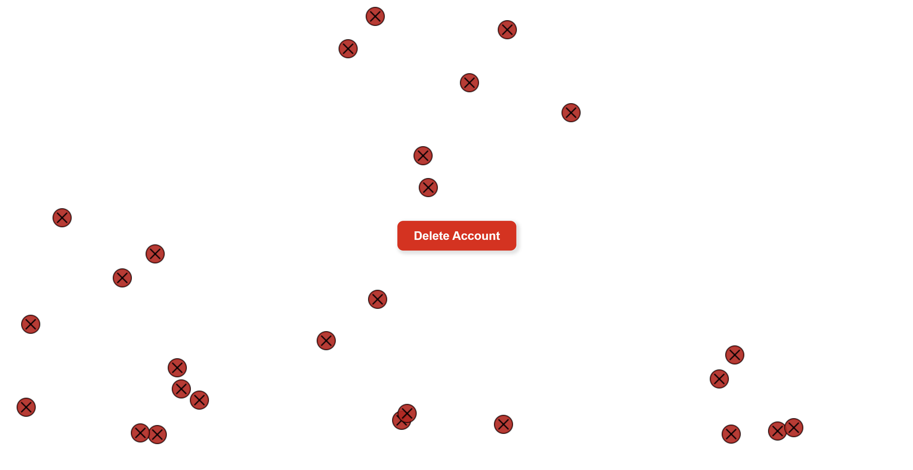
For the boss fight, I had much grander ideas than was feasible. Inspired by the <b>True Pacifist Flowey Fight</b>, I wanted a sort of "biblically accurate cup thing" with a really difficult and varying bullet pattern. Realizing that I was almost at the end of the week, I decided to put the original delete button there instead, opting to make a random downwards bullet pattern (which I still think is somewhat difficult). 